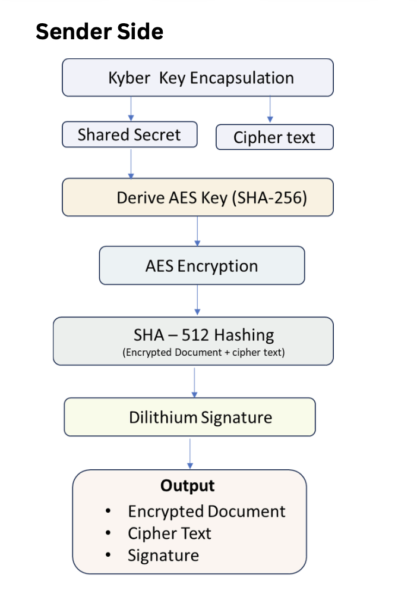
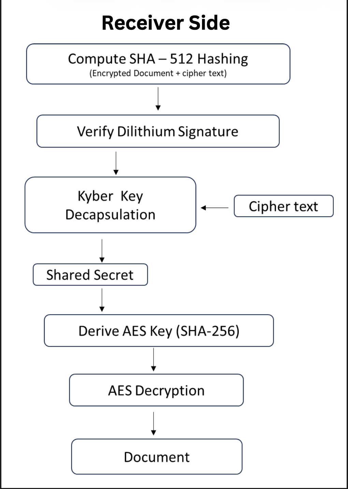
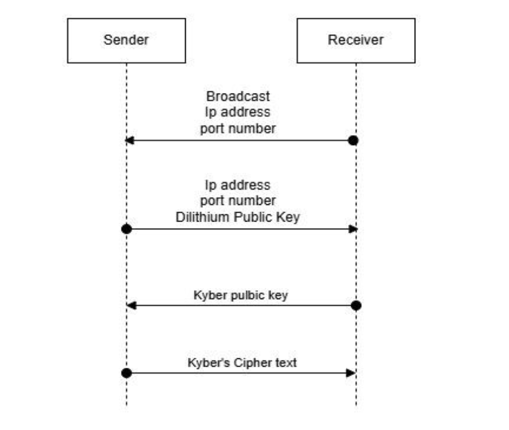

# 🔐 PQDocSec  
**Post-Quantum Cryptographic Framework for Secure Document Encryption & Digital Signatures**

---

## 📌 Overview  
**PQDocSec** is a secure framework designed to protect documents using **Post-Quantum Cryptography (PQC)**. It ensures confidentiality and authenticity through:

- 🔑 **Kyber (KEM)** → Secure key exchange  
- ✍️ **Dilithium** → Digital signatures  

The system is divided into **Sender-side** and **Receiver-side** workflows, enabling secure communication resistant to future quantum attacks.

---

## 🧩 Architecture  

### 🧑‍💻 Sender-Side Framework  


- Encrypts documents using shared secret (Kyber)
- Signs documents using Dilithium
- Sends encrypted + signed data to receiver

---

### 📥 Receiver-Side Framework  


- Decapsulates shared key using Kyber
- Decrypts document
- Verifies signature using Dilithium

---

### 🔄 Key Exchange Flow  


- Kyber-based Key Encapsulation Mechanism (KEM)
- Secure shared secret establishment
- Used for encryption/decryption pipeline

---

## 🚀 Getting Started  

### 1️⃣ Clone the Repository  
```bash
git clone <your-repo-url>
cd PQDocSec
```

## 💻 Client Side Setup
```bash
cd server
npm install
npm run dev
```

## ⚙️ Compile liboqs-based PQC Binaries

### 📁 Create Required Directories
```bash
mkdir -p server/app/services/PQC/kyber/bin
mkdir -p server/app/services/PQC/dilithium/bin
```

### 🔐 KYBER (Key Encapsulation Mechanism)

#### Kyber Key Generation
```bash
clang server/app/services/PQC/kyber/kyber_keygen.c \
 -o server/app/services/PQC/kyber/bin/kyber_keygen \
 $(pkg-config --cflags --libs liboqs) \
 -L/opt/homebrew/opt/openssl@3/lib -lcrypto -lssl
```

#### Kyber Encapsulation
```bash
clang server/app/services/PQC/kyber/kyber_encaps.c \
 -o server/app/services/PQC/kyber/bin/kyber_encaps \
 $(pkg-config --cflags --libs liboqs) \
 -L/opt/homebrew/opt/openssl@3/lib -lcrypto -lssl
```

#### Kyber Decapsulation
```bash
clang server/app/services/PQC/kyber/kyber_decaps.c \
 -o server/app/services/PQC/kyber/bin/kyber_decaps \
 $(pkg-config --cflags --libs liboqs) \
 -L/opt/homebrew/opt/openssl@3/lib -lcrypto -lssl
```

### ✍️ DILITHIUM (Digital Signatures)

#### Dilithium Key Generation
```bash
clang server/app/services/PQC/dilithium/dilithium_keygen.c \
 -o server/app/services/PQC/dilithium/bin/dilithium_keygen \
 $(pkg-config --cflags --libs liboqs) \
 -L/opt/homebrew/opt/openssl@3/lib -lcrypto -lssl
```

#### Dilithium Sign
```bash
clang server/app/services/PQC/dilithium/dilithium_sign.c \
 -o server/app/services/PQC/dilithium/bin/dilithium_sign \
 $(pkg-config --cflags --libs liboqs) \
 -L/opt/homebrew/opt/openssl@3/lib -lcrypto -lssl
```

#### Dilithium Verify
```bash
clang server/app/services/PQC/dilithium/dilithium_verify.c \
 -o server/app/services/PQC/dilithium/bin/dilithium_verify \
 $(pkg-config --cflags --libs liboqs) \
 -L/opt/homebrew/opt/openssl@3/lib -lcrypto -lssl
```

### 🔓 Make Binaries Executable
```bash
chmod +x server/app/services/PQC/kyber/bin/*
chmod +x server/app/services/PQC/dilithium/bin/*
```

## 🖥️ Server Side Setup
```bash
python3 -m venv .venv
source .venv/bin/activate

pip install -r requirements.txt

python3 app.py
```

## 🧠 Key Highlights  

- 🚀 Quantum-resistant cryptography  
- 🔐 Secure key exchange using Kyber  
- ✍️ Strong digital signatures with Dilithium  
- 🧩 Modular architecture (easy to extend)  
- 📄 Focused on real-world document security  

---

## 📌 Future Improvements  

- 🌐 Web UI for easier interaction  
- 🔗 Support for hybrid cryptography (Classical + PQC)  
- 📊 Performance benchmarking  
- ☁️ Deployment using Docker/Cloud  

---

## 👨‍💻 Author  

Developed as a final project focusing on **next-generation cryptographic security**.

---

## 📜 License  

This project is intended for **academic and research purposes**.